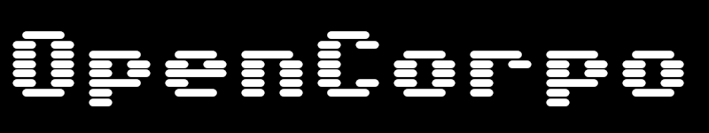
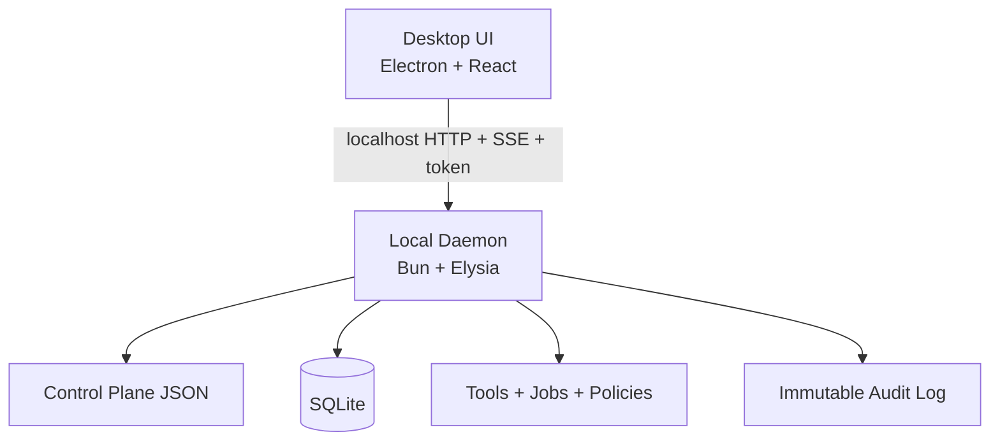

<div align="center">
  

  # OpenCorpo

  **Self-editing, local-first business operating system powered by an AI operator.**

  <p>
    <a href="#quick-start">Quick Start</a> •
    <a href="#installation">Installation</a> •
    <a href="#architecture">Architecture</a> •
    <a href="#security-model">Security</a> •
    <a href="#roadmap">Roadmap</a>
  </p>

  <p>
    
    
    
    
  </p>
</div>

---

## What OpenCorpo Is

OpenCorpo is a desktop-first, local AI operating system for business workflows.

It combines:
- an Electron desktop app for chat, approvals, audits, and operations
- a local Bun daemon for tools, jobs, policies, and agent runtime
- a declarative control plane the AI can edit safely

The design goal is simple: **let AI act without making your system dangerous**.

## Self-Editing

OpenCorpo is not just a chatbot. It can **edit and evolve its own product surface** through a validated control plane.

Out of the box, the AI can:
- add/edit sidebar routes and pages in `ui/desktop.json`
- compose new pages with markdown, notes, stats, and job-driven tables
- embed live web experiences with `web_embed` (iframe-backed blocks)
- add npm-powered `react_widget` components to pages
- spin up `terminal_widget` blocks for interactive command output
- propose config/code changes with previews, approvals, and audit trails

## Why It Exists

Most AI products stop at chat. OpenCorpo is built for execution:
- plan and run work
- schedule recurring jobs
- reconfigure workflows through validated JSON
- keep every important action auditable

## Inspired By OpenClaw

OpenCorpo is inspired by the direction and momentum of [OpenClaw](https://github.com/openclaw/openclaw), especially around practical local-first agent workflows and strong docs ergonomics.

If you like this project, you should absolutely check OpenClaw out too.

## Quick Start

### 1) Prerequisites

- Node.js 18+ (Node 20/22 recommended)
- Bun 1.x on your PATH
- npm (ships with Node)

### 2) Install dependencies

```bash
npm install
```

### 3) Run desktop (recommended)

```bash
npm run dev:desktop
```

This starts the desktop app; OpenCorpo will boot/supervise the daemon for you.

### 4) Optional: run daemon only (debug)

```bash
bun run dev:daemon
```

## Installation

### Local Development Install (from source)

```bash
git clone https://github.com/toby/OpenCorpo.git
cd OpenCorpo
npm install
npm run dev:desktop
```

### Build Desktop App

```bash
npm run build:desktop
```

### Package Desktop App

```bash
npm run pack:desktop
```

### Create Distributables

```bash
npm run dist:desktop
```

Packaged desktop builds can bundle Bun via `apps/desktop/scripts/prepare-bun-runtime.mjs` when Bun is available on the build machine.

## Developer Commands

| Command | Purpose |
| --- | --- |
| `npm run dev:desktop` | Run desktop app in development mode |
| `npm run dev:renderer` | Run React renderer only |
| `npm run dev:electron` | Run Electron shell only |
| `npm run dev:daemon` | Run daemon directly via Bun |
| `npm run test:smoke` | Run daemon + desktop smoke checks |

## Architecture



### Core Components

- `apps/desktop`: desktop shell + renderer UI
- `apps/daemon`: local API, agent runtime, orchestration
- `config/`: declarative control plane (policy/tools/jobs/ui)
- `data/`: runtime mutable config and state
- `userland/`: workspace for explicit Tier-B code changes

## Control Plane Philosophy

OpenCorpo defaults to **declarative mutation**:
- AI edits JSON control-plane config first
- every change is schema-validated
- diffs can be previewed before apply
- policy checks and risk gating happen before execution
- audit records are append-only

Tier model:
- Tier A: config edits (`config/**/*.json`) (default)
- Tier B: code patches (rare, explicit, user-approved)

## Security Model

### Tool-only execution

The agent does not get implicit DB or network access. It must use registered tools.

### Capability gating

Each tool/job requires explicit capabilities that are scoped and revocable.

### Policy + approvals

Risky actions can be blocked or require approval.

### Immutable auditing

Important events include actor, action, policy decision, timestamps, and correlation metadata.

## AI Providers

OpenCorpo supports pluggable providers through the AI SDK setup.

Current UX includes:
- API-key based provider setup
- Codex ChatGPT subscription OAuth path in Settings (`Codex (ChatGPT)`)

## Current Status

OpenCorpo is in **very early beta**.

Expect:
- breaking changes
- evolving schemas/APIs
- incomplete features
- rapidly improving docs

## Roadmap

- production-hardening for packaged desktop runtime
- stronger long-running planner/worker behavior
- richer workspace patch previews in the desktop UI
- release channel automation (stable/beta/dev)
- version control

## Contributing

Contributions are welcome.

- open Issues for bugs and proposals
- submit focused PRs
- prefer small, reviewable changes
- prioritize safety, auditability, and local-first behavior

## License

MIT
